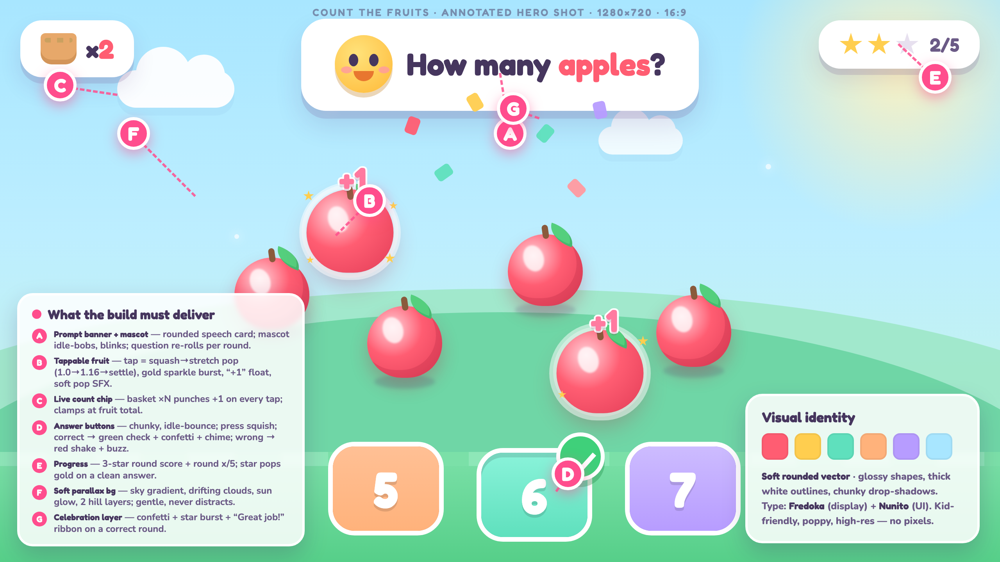

# Count the Fruits

A polished, kid-friendly **tap-to-count** mini-game built in Unity 6000.3 (2D) — a Kidopia-style
counting prototype. Tap the fruit to count them, then pick the matching number. Five rounds with a
gentle difficulty ramp, a star score, and a "Great job!" results screen.

## How to play
Open the project in Unity `6000.3.9f1`, open `Assets/Scenes/CountTheFruits.unity`, press **Play**,
and click the fruit + answer buttons with the mouse (touch works on device).

## Gameplay
- Each round scatters **N** apples and asks *"How many apples?"*
- Tap fruit → squash-stretch pop, sparkle, "+1", and a green "counted" check; the basket chip tracks the live count.
- Pick the right number → green check + confetti + chime + a star; wrong → gentle shake + buzz, try again (no lose state).
- Difficulty ramps 3 → 4 → 5 → 6 → 7 fruit across 5 rounds, then a results screen with **Play again**.

## Project layout
- `Assets/Scenes/CountTheFruits.unity` — the game scene
- `Assets/Scripts/` — `Core` (GameManager, FruitSpawner, CountManager, SfxPlayer, TapInput), `Interactables` (Fruit), `UI` (HUD, answer buttons, end screen), `FX`
- `Assets/Art/{bg,fruit,fx,hud,ui}` — generated soft-rounded-vector sprites
- `Assets/Audio/` — procedural SFX + music bed
- `Assets/Fonts/` — Fredoka (display) + Nunito (UI)
- `Tools/gen_*.py` — the asset generators (Python + PIL/numpy/fontTools); re-run to regenerate art/audio
- `.loomtide/design/` — the frozen design target (hero shot) and the build plan (`COUNT_THE_FRUITS_PLAN.md`)

## Notes
Built through the Loomtide MCP Unity bridge, one polished slice at a time, measured against the
frozen hero shot. It is a **standalone counting game** and intentionally does not target Loomtide's
platformer verification gates. Audio is procedurally generated and may benefit from a taste pass.

## Requirements
- Unity 6000.3 LTS
- Packages: 2D Sprite, 2D Pixel Perfect, Input System, uGUI, Animation, Audio, Physics2D (see `Packages/manifest.json`)
