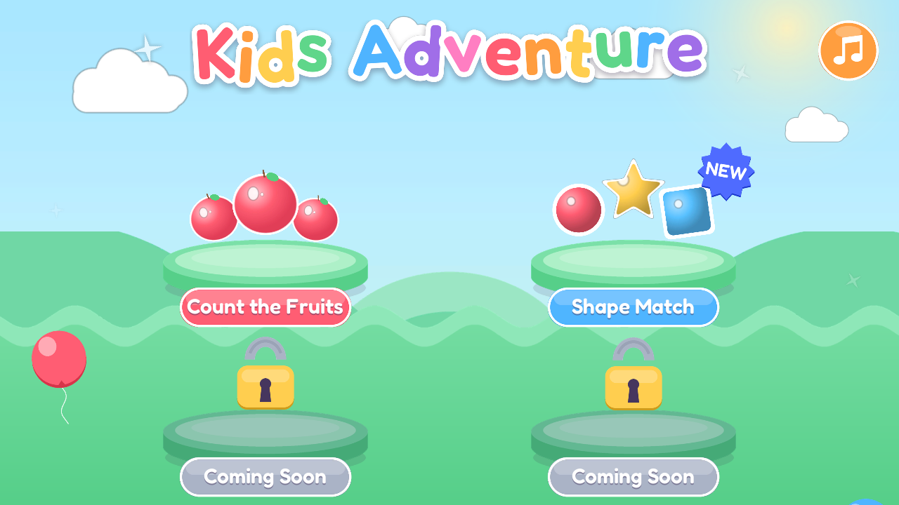

# Kids Adventure

A polished, kid-friendly **mini-game package** built in Unity 6000.3 (2D) — a Kiddopia-style
home-screen hub that links three gentle, no-fail mini-games. Pick a tile, play, and tap the
pink Home button (top-left in every game) to come back to the hub.

## How to play
Open the project in Unity `6000.3.9f1`, open `Assets/Scenes/KidsAdventure.unity`, press **Play**,
and tap a tile (touch works on device). Each game scene also runs standalone.

## The mini-games
- **Count the Fruits** (`Assets/Scenes/CountTheFruits.unity`) — tap-to-count. Each round scatters
  N apples and asks *"How many apples?"*; tap fruit to count them, pick the matching number.
  Difficulty ramps 3 → 7 across 5 rounds, then stars and a "Great job!" screen.
- **Shape Match** (`Assets/Scenes/ShapeMatch.unity`) — match the target shape from three answer
  tiles. Five rounds, star progress, reward screen. Self-contained under `Assets/Scripts/ShapeMatch/`.
- **Kids Chef** (`Assets/Scenes/KidsChef.unity`) — cook waffles in three steps: drag ingredients
  into the bowl and stir, spray + pour + cook in the waffle maker, then decorate with toppings.
  Drag/drop/mix gestures, no fail states. Under `Assets/Scripts/Chef/`.

## Project layout
- `Assets/Scenes/` — `KidsAdventure` (hub, first in Build Settings) + the three game scenes
- `Assets/Scripts/` — `Home` (hub), `Core`/`Interactables`/`UI`/`FX` (Count the Fruits),
  `ShapeMatch`, `Chef` — each game is namespaced and shares no code with the others
- `Assets/Art/{home,bg,fruit,fx,hud,ui,shapematch,chef}` — generated soft-rounded-vector sprites
- `Assets/Audio/` — procedural SFX + per-game music beds
- `Assets/Fonts/` — Fredoka (display) + Nunito (UI)
- `Tools/gen_*.py` — the asset generators (Python + PIL/numpy/fontTools); re-run to regenerate art/audio
- `Assets/Editor/` — scene builders (`KidsAdventureHomeBuilder`, `KidsChefBuilder`,
  `ShapeMatchSceneBuilder`, `KidsPolishBuilder`) runnable from the "KidsAdventure" menu or batch `-executeMethod`
- `.loomtide/design/` — frozen design targets (hero shots) and build plans

## Notes
Built through the Loomtide MCP Unity bridge, one polished slice at a time, measured against
frozen hero shots. These are **standalone kids' games** and intentionally do not target
Loomtide's platformer verification gates. Audio is procedurally generated and may benefit
from a taste pass.

## Requirements
- Unity 6000.3 LTS
- Packages: 2D Sprite, 2D Pixel Perfect, Input System, uGUI, Animation, Audio, Physics2D (see `Packages/manifest.json`)
